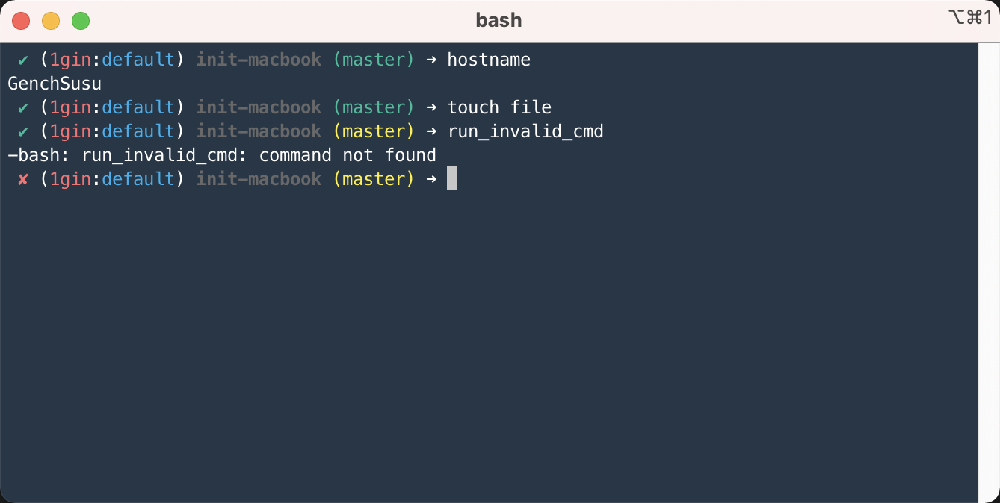

## RELEASE NOTE:
安装Homebrew

安装iterm2 + .bash_profile 

自动导入Profile颜色主题

Prompt中集成:
- kube-ps1
- $?返回值 
  - ✔ 
  - ✘
- git的分支
  - 如果有未递交code会变色

iTerm2:


初始化安装一系列常用软件

```
Brew_list:
  awscli
  bash
  bash-completion@2
  brew-cask-completion
  fzf
  git
  go
  httpstat
  jq
  kubernetes-cli
  kube-ps1
  kubectl
  kubectx
  mas
  node
  python
  readline
  telnet
  tree
  vim
  watch
  wget
  
Brew_cask_list:
  alfred
  android-file-transfer
  caffeine
  docker
  doubletwist
  flux
  google-chrome
  iina
  iterm2
  1password
  rectangle
  skim
  snipaste
  transmission
  timeout
  timing
  visual-studio-code
```  

 
